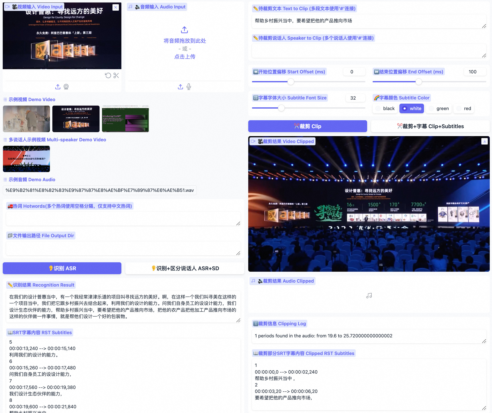
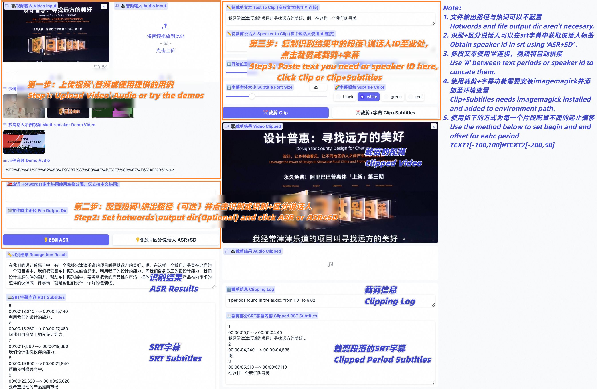
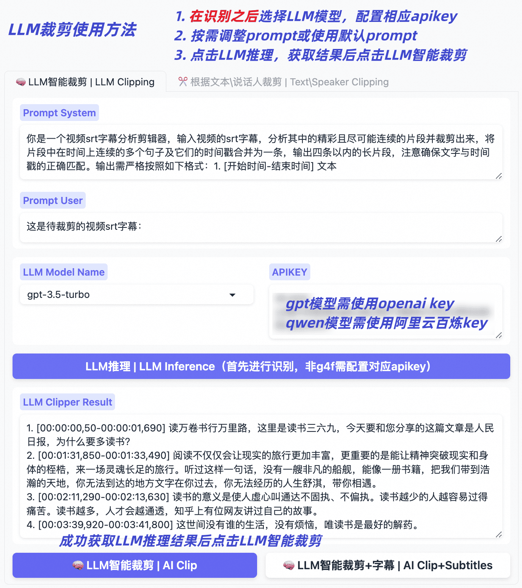

[](https://github.com/Akshay090/svg-banners)

### <p align="center">「[简体中文](./README_zh.md) | English」</p>

**<p align="center"> ⚡ Open-source, accurate and easy-to-use video clipping tool </p>**
**<p align="center"> 🧠 Explore LLM based video clipping with FunClip </p>**

<p align="center"> </p>

<p align="center" class="trendshift">
<a href="https://trendshift.io/repositories/20318" target="_blank"></a>
</p>

<div align="center">  
<h4>
<a href="#What's New"> What's New </a>
｜<a href="#On Going"> On Going </a>
｜<a href="#Install"> Install </a>
｜<a href="#Usage"> Usage </a>
｜<a href="#Community"> Community </a>
</h4>
</div>

**FunClip** is a fully open-source, locally deployed automated video clipping tool. It leverages Alibaba TONGYI speech lab's open-source [FunASR](https://github.com/modelscope/FunASR) Paraformer series models to perform speech recognition on videos. Then, users can freely choose text segments or speakers from the recognition results and click the clip button to obtain the video clip corresponding to the selected segments (Quick Experience [Modelscope⭐](https://modelscope.cn/studios/iic/funasr_app_clipvideo/summary) [HuggingFace🤗](https://huggingface.co/spaces/FunAudioLLM/FunClip)).

## Highlights🎨

- 🔥Try AI clipping using LLM in FunClip now.
- FunClip integrates Alibaba's open-source industrial-grade model [Paraformer-Large](https://modelscope.cn/models/iic/speech_paraformer-large_asr_nat-zh-cn-16k-common-vocab8404-pytorch/summary), which is one of the best-performing open-source Chinese ASR models available, with over 13 million downloads on Modelscope. It can also accurately predict timestamps in an integrated manner.
- FunClip incorporates the hotword customization feature of [SeACo-Paraformer](https://modelscope.cn/models/iic/speech_seaco_paraformer_large_asr_nat-zh-cn-16k-common-vocab8404-pytorch/summary), allowing users to specify certain entity words, names, etc., as hotwords during the ASR process to enhance recognition results.
- FunClip integrates the [CAM++](https://modelscope.cn/models/iic/speech_campplus_sv_zh-cn_16k-common/summary) speaker recognition model, enabling users to use the auto-recognized speaker ID as the target for trimming, to clip segments from a specific speaker.
- The functionalities are realized through Gradio interaction, offering simple installation and ease of use. It can also be deployed on a server and accessed via a browser.
- FunClip supports multi-segment free clipping and automatically returns full video SRT subtitles and target segment SRT subtitles, offering a simple and convenient user experience.

<a name="What's New"></a>
## What's New🚀
- 2026/05/20 FunClip now supports [Fun-ASR-Nano](https://huggingface.co/FunAudioLLM/Fun-ASR-Nano-2512) and [SenseVoice](https://huggingface.co/FunAudioLLM/SenseVoiceSmall) models. The `fun-asr-nano` option loads the flagship Fun-ASR-Nano-2512 checkpoint for Mandarin, English, Japanese, 7 Chinese dialect groups, and 26 regional accents; it does not load the separate 31-language Fun-ASR-MLT-Nano-2512 checkpoint. SenseVoice adds emotion recognition and audio event detection. Run `python funclip/launch.py -m fun-asr-nano` or `-m sensevoice` to try. For precise text-based clipping, use Paraformer because the released Nano checkpoint does not provide reliable character-level timestamps.
- 2024/06/12 FunClip supports recognize and clip English audio files now. Run `python funclip/launch.py -l en` to try.
- 🔥2024/05/13 FunClip v2.0.0 now supports smart clipping with large language models, integrating models from the qwen series, GPT series, etc., providing default prompts. You can also explore and share tips for setting prompts, the usage is as follows:
  1. After the recognition, select the name of the large model and configure your own apikey;
  2. Click on the 'LLM Inference' button, and FunClip will automatically combine two prompts with the video's srt subtitles;
  3. Click on the 'AI Clip' button, and based on the output results of the large language model from the previous step, FunClip will extract the timestamps for clipping;
  4. You can try changing the prompt to leverage the capabilities of the large language models to get the results you want;
- 2024/05/09 FunClip updated to v1.1.0, including the following updates and fixes:
  - Support configuration of output file directory, saving ASR intermediate results and video clipping intermediate files;
  - UI upgrade (see guide picture below), video and audio cropping function are on the same page now, button position adjustment;
  - Fixed a bug introduced due to FunASR interface upgrade, which has caused some serious clipping errors;
  - Support configuring different start and end time offsets for each paragraph;
  - Code update, etc;
- 2024/03/06 Fix bugs in using FunClip with command line.
- 2024/02/28 [FunASR](https://github.com/modelscope/FunASR) is updated to 1.0 version, use FunASR1.0 and SeACo-Paraformer to conduct ASR with hotword customization.
- 2023/10/17 Fix bugs in multiple periods chosen, used to return video with wrong length.
- 2023/10/10 FunClipper now supports recognizing with speaker diarization ability, choose 'yes' button in 'Recognize Speakers' and you will get recognition results with speaker id for each sentence. And then you can clip out the periods of one or some speakers (e.g. 'spk0' or 'spk0#spk3') using FunClipper.

<a name="On Going"></a>
## On Going🌵

- [x] FunClip will support Whisper model for English users, coming soon (ASR using Whisper with timestamp requires massive GPU memory, we support timestamp prediction for vanilla Paraformer in FunASR to achieving this).
- [x] FunClip will further explore the abilities of large langage model based AI clipping, welcome to discuss about prompt setting and clipping, etc.
- [ ] Reverse periods choosing while clipping.
- [ ] Removing silence periods.

<a name="Install"></a>
## Install🔨

### Python env install

FunClip basic functions rely on a python environment only.
```shell
# clone funclip repo
git clone https://github.com/modelscope/FunClip.git
cd FunClip
# install Python requirments
pip install -r ./requirements.txt
```

### imagemagick install (Optional)

If you want to clip video file with embedded subtitles

1. ffmpeg and imagemagick is required

- On Ubuntu
```shell
apt-get -y update && apt-get -y install ffmpeg imagemagick
sed -i 's/none/read,write/g' /etc/ImageMagick-6/policy.xml
```
- On MacOS
```shell
brew install imagemagick
sed -i '' 's/none/read,write/g' "$(brew --prefix imagemagick)/etc/ImageMagick-7/policy.xml" 
```
- On Windows

Download and install imagemagick https://imagemagick.org/script/download.php#windows

Find your python install path and change the `IMAGEMAGICK_BINARY` to your imagemagick install path in file `site-packages\moviepy\config_defaults.py`

2. Download font file to funclip/font

```shell
wget https://isv-data.oss-cn-hangzhou.aliyuncs.com/ics/MaaS/ClipVideo/STHeitiMedium.ttc -O font/STHeitiMedium.ttc
```
<a name="Usage"></a>
## Use FunClip

### A. Use FunClip as local Gradio Service
You can establish your own FunClip service which is same as [Modelscope Space](https://modelscope.cn/studios/iic/funasr_app_clipvideo/summary) as follow:
```shell
python funclip/launch.py
# '-m fun-asr-nano' for the flagship Fun-ASR-Nano model (Mandarin, English,
# Japanese, 7 Chinese dialect groups, and 26 regional accents)
# '-m sensevoice' for SenseVoice model (multilingual ASR + emotion + audio event detection)
# '-l en' for English audio recognize
# '-p xxx' for setting port number
# '-s True' for establishing service for public accessing
```

#### Model selection quick start

| Scenario | Command |
| --- | --- |
| Default Chinese video clipping with Paraformer | `python funclip/launch.py` |
| High-accuracy transcription with the flagship Fun-ASR-Nano checkpoint (use Paraformer for precise text-based clipping) | `python funclip/launch.py -m fun-asr-nano` |
| Multilingual ASR with emotion and audio event tags | `python funclip/launch.py -m sensevoice` |
| English video clipping with the Paraformer English model | `python funclip/launch.py -l en` |

then visit ```localhost:7860``` you will get a Gradio service like below and you can use FunClip following the steps:

- Step1: Upload your video file (or try the example videos below)
- Step2: Copy the text segments you need to 'Text to Clip'
- Step3: Adjust subtitle settings (if needed)
- Step4: Click 'Clip' or 'Clip and Generate Subtitles'



Follow the guide below to explore LLM based clipping:



#### Content-aware clipping with TwelveLabs Pegasus (optional)

Besides the transcript-based LLMs above, FunClip can optionally use [TwelveLabs](https://twelvelabs.io) Pegasus, a video understanding model that reasons over the actual video (visuals + audio) rather than only the ASR transcript. This helps pick highlight segments even when the transcript alone is ambiguous (e.g. action, scene changes, on-screen events). To use it, select the `pegasus1.5` model name, paste your TwelveLabs API key, upload a video, and click 'LLM Inference' — Pegasus returns segments in the same `N. [start-end] text` format, so the existing 'AI Clip' button works unchanged. It needs `pip install twelvelabs`, and a free API key is available at https://twelvelabs.io.

### B. Experience FunClip in Modelscope

[FunClip@Modelscope Space⭐](https://modelscope.cn/studios/iic/funasr_app_clipvideo/summary)

[FunClip@HuggingFace Space🤗](https://huggingface.co/spaces/FunAudioLLM/FunClip)

### C. Use FunClip in command line

FunClip supports you to recognize and clip with commands:
```shell
# download the example video used in the commands below
mkdir -p examples
wget "https://huggingface.co/spaces/R1ckShi/FunClip/resolve/main/examples/2022%E4%BA%91%E6%A0%96%E5%A4%A7%E4%BC%9A_%E7%89%87%E6%AE%B5.mp4" -O "examples/2022云栖大会_片段.mp4"

# step1: Recognize
python funclip/videoclipper.py --stage 1 \
                       --file examples/2022云栖大会_片段.mp4 \
                       --output_dir ./output
# now you can find recognition results and entire SRT file in ./output/
# step2: Clip
python funclip/videoclipper.py --stage 2 \
                       --file examples/2022云栖大会_片段.mp4 \
                       --output_dir ./output \
                       --dest_text '我们把它跟乡村振兴去结合起来，利用我们的设计的能力' \
                       --start_ost 0 \
                       --end_ost 100 \
                       --output_file './output/res.mp4'
```

<a name="Community"></a>
## Community Communication🍟

FunClip is firstly open-sourced bu FunASR team, any useful PR is welcomed.

You can also scan the following DingTalk group or WeChat group QR code to join the community group for communication.

|                           DingTalk group                            |                     WeChat group                      |
|:-------------------------------------------------------------------:|:-----------------------------------------------------:|
| <div align="left"> | </div> |

## Ecosystem

FunClip is part of the **FunAudioLLM** family:

| Project | Description | Stars |
|---------|-------------|-------|
| [FunASR](https://github.com/modelscope/FunASR) | Industrial speech recognition toolkit — VAD, ASR, punctuation, diarization | [](https://github.com/modelscope/FunASR) |
| [Fun-ASR-Nano](https://github.com/FunAudioLLM/Fun-ASR) | End-to-end LLM-based ASR — flagship and separate 31-language MLT checkpoints, streaming, hotwords ([HF model](https://huggingface.co/FunAudioLLM/Fun-ASR-Nano-2512)) | [](https://github.com/FunAudioLLM/Fun-ASR) |
| [SenseVoice](https://github.com/FunAudioLLM/SenseVoice) | Multilingual speech understanding — ASR + emotion + audio events ([HF model](https://huggingface.co/FunAudioLLM/SenseVoiceSmall)) | [](https://github.com/FunAudioLLM/SenseVoice) |
| [CosyVoice](https://github.com/FunAudioLLM/CosyVoice) | Natural speech generation — multi-language, zero-shot cloning | [](https://github.com/FunAudioLLM/CosyVoice) |

📚FunASR Paper: <a href="https://arxiv.org/abs/2305.11013"></a> 
📚SeACo-Paraformer Paper: <a href="https://arxiv.org/abs/2308.03266"></a>

## License

- FunClip source code is licensed under the [MIT License](./LICENSE).
- Model weights are downloaded separately and are governed by the terms on their model pages. The default [Paraformer-Large](https://modelscope.cn/models/iic/speech_paraformer-large_asr_nat-zh-cn-16k-common-vocab8404-pytorch/summary), [SeACo-Paraformer](https://modelscope.cn/models/iic/speech_seaco_paraformer_large_asr_nat-zh-cn-16k-common-vocab8404-pytorch/summary), and [CAM++](https://modelscope.cn/models/iic/speech_campplus_sv_zh-cn_16k-common/summary) pages currently list Apache License 2.0; check the applicable model page before redistribution.

## Star History

[](https://star-history.com/#modelscope/FunClip&Date)
