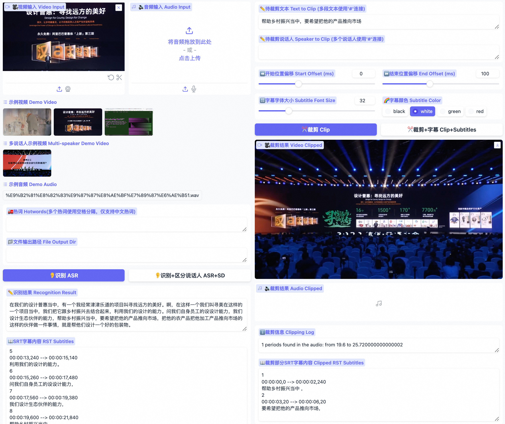
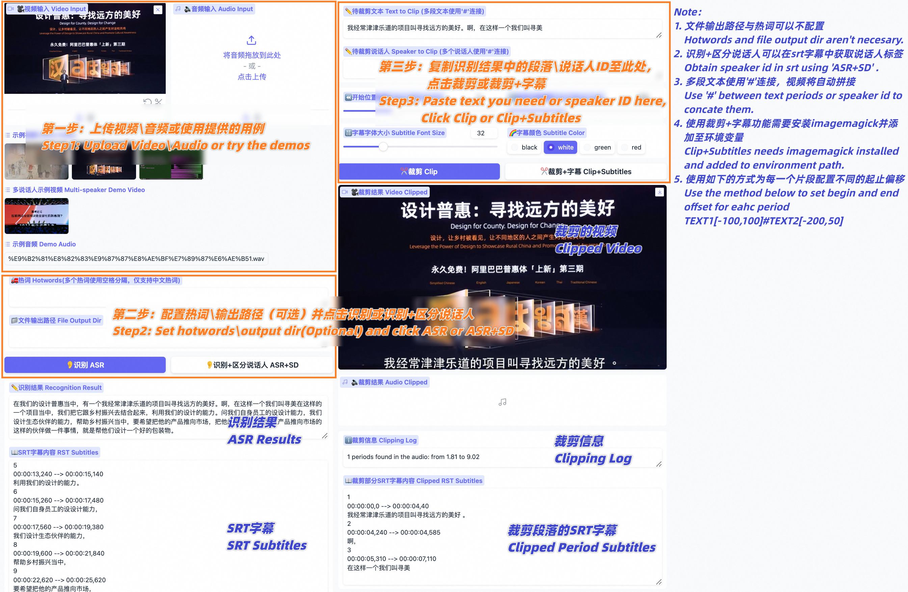
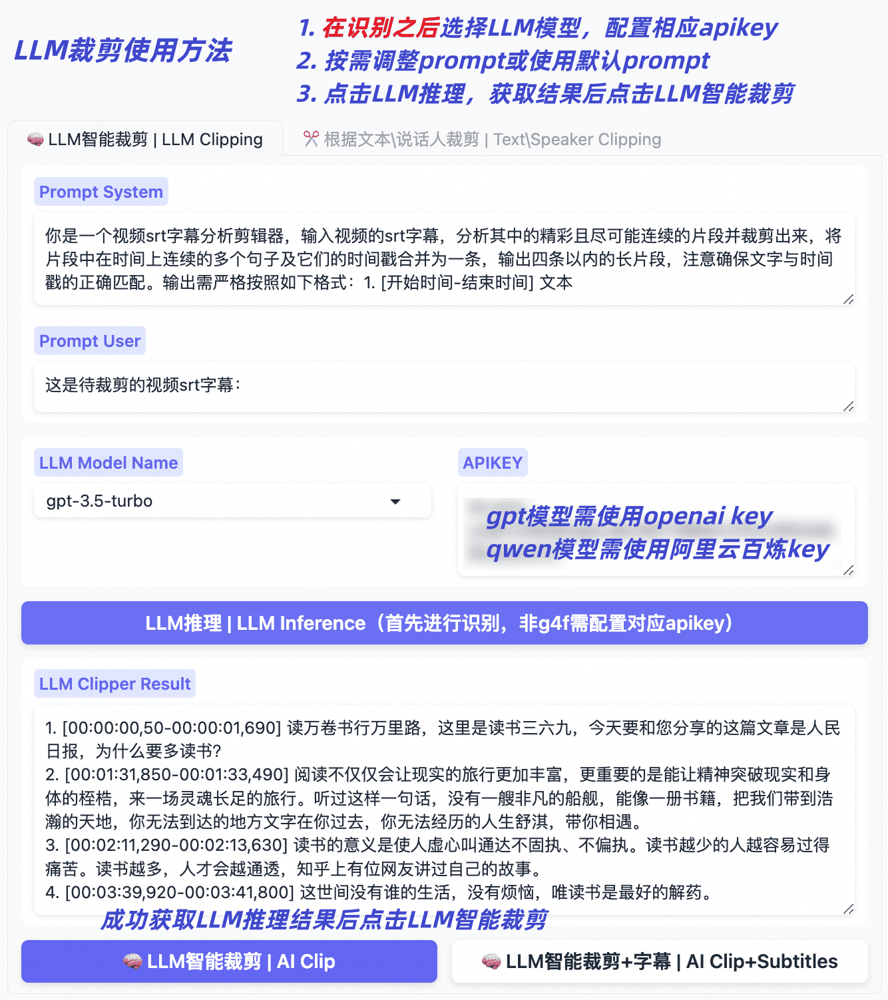

[](https://github.com/Akshay090/svg-banners)

### <p align="center">「简体中文 | [English](./README.md)」</p>

**<p align="center"> ⚡ 开源、精准、方便的视频切片工具 </p>**
**<p align="center"> 🧠 通过FunClip探索基于大语言模型的视频剪辑 </p>**

<p align="center"> </p>

<p align="center" class="trendshift">
<a href="https://trendshift.io/repositories/10126" target="_blank"></a>
</p>

<div align="center">  
<h4><a href="#近期更新"> 近期更新 </a>
｜<a href="#施工中"> 施工中 </a>
｜<a href="#安装环境"> 安装环境 </a>
｜<a href="#使用方法"> 使用方法 </a>
｜<a href="#社区交流"> 社区交流 </a>
</h4>
</div>

**FunClip**是一款完全开源、本地部署的自动化视频剪辑工具，通过调用阿里巴巴通义实验室开源的[FunASR](https://github.com/alibaba-damo-academy/FunASR) Paraformer系列模型进行视频的语音识别，随后用户可以自由选择识别结果中的文本片段或说话人，点击裁剪按钮即可获取对应片段的视频（快速体验 [Modelscope⭐](https://modelscope.cn/studios/iic/funasr_app_clipvideo/summary)  [HuggingFace🤗](https://huggingface.co/spaces/R1ckShi/FunClip)）。

## 热点&特性🎨

- 🔥FunClip集成了多种大语言模型调用方式并提供了prompt配置接口，尝试通过大语言模型进行视频裁剪~
- FunClip集成了阿里巴巴开源的工业级模型[Paraformer-Large](https://modelscope.cn/models/iic/speech_paraformer-large_asr_nat-zh-cn-16k-common-vocab8404-pytorch/summary)，是当前识别效果最优的开源中文ASR模型之一，Modelscope下载量1300w+次，并且能够一体化的准确预测时间戳。
- FunClip集成了[SeACo-Paraformer](https://modelscope.cn/models/iic/speech_seaco_paraformer_large_asr_nat-zh-cn-16k-common-vocab8404-pytorch/summary)的热词定制化功能，在ASR过程中可以指定一些实体词、人名等作为热词，提升识别效果。
- FunClip集成了[CAM++](https://modelscope.cn/models/iic/speech_campplus_sv_zh-cn_16k-common/summary)说话人识别模型，用户可以将自动识别出的说话人ID作为裁剪目标，将某一说话人的段落裁剪出来。
- 通过Gradio交互实现上述功能，安装简单使用方便，并且可以在服务端搭建服务通过浏览器使用。
- FunClip支持多段自由剪辑，并且会自动返回全视频SRT字幕、目标段落SRT字幕，使用简单方便。

欢迎体验使用，欢迎提出关于字幕生成或语音识别的需求与宝贵建议~

<a name="近期更新"></a>
## 近期更新🚀

- 2024/06/12 FunClip现在支持识别与裁剪英文视频，通过`python funclip/launch.py -l en`来启动英文版本服务。
- 🔥2024/05/13 FunClip v2.0.0加入大语言模型智能裁剪功能，集成qwen系列，gpt系列等模型，提供默认prompt，您也可以探索并分享prompt的设置技巧，使用方法如下：
  1. 在进行识别之后，选择大模型名称，配置你自己的apikey；
  2. 点击'LLM智能段落选择'按钮，FunClip将自动组合两个prompt与视频的srt字幕；
  3. 点击'LLM智能裁剪'按钮，基于前一步的大语言模型输出结果，FunClip将提取其中的时间戳进行裁剪；
  4. 您可以尝试改变prompt来借助大语言模型的能力来获取您想要的结果；
- 2024/05/09 FunClip更新至v1.1.0，包含如下更新与修复：
  - 支持配置输出文件目录，保存ASR中间结果与视频裁剪中间文件；
  - UI升级（见下方演示图例），视频与音频裁剪功能在同一页，按钮位置调整；
  - 修复了由于FunASR接口升级引入的bug，该bug曾导致一些严重的剪辑错误；
  - 支持为每一个段落配置不同的起止时间偏移；
  - 代码优化等；
- 2024/03/06 命令行调用方式更新与问题修复，相关功能可以正常使用。
- 2024/02/28 FunClip升级到FunASR1.0模型调用方式，通过FunASR开源的SeACo-Paraformer模型在视频剪辑中进一步支持热词定制化功能。
- 2024/02/28 原FunASR-APP/ClipVideo更名为FunClip。

<a name="施工中"></a>
## 施工中🌵

- [x] FunClip将会集成Whisper模型，以提供英文视频剪辑能力(Whisper模型的时间戳预测功能需要显存较大，我们在FunASR中添加了Paraformer英文模型的时间戳预测支持以允许FunClip支持英文识别裁剪)。
- [x] 集成大语言模型的能力，提供智能视频剪辑相关功能。大家可以基于FunClip探索使用大语言模型的视频剪辑~
- [ ] 给定文本段落，反向选取其他段落。
- [ ] 删除视频中无人说话的片段。

<a name="安装环境"></a>
## 安装🔨

### Python环境安装

FunClip的运行仅依赖于一个Python环境，若您是一个小白开发者，可以先了解下如何使用Python，pip等~
```shell
# 克隆funclip仓库
git clone https://github.com/alibaba-damo-academy/FunClip.git
cd FunClip
# 安装相关Python依赖
pip install -r ./requirements.txt
```

### 安装imagemagick（可选）

1. 如果你希望使用自动生成字幕的视频裁剪功能，需要安装imagemagick

- Ubuntu
```shell
apt-get -y update && apt-get -y install ffmpeg imagemagick
sed -i 's/none/read,write/g' /etc/ImageMagick-6/policy.xml
```
- MacOS
```shell
brew install imagemagick
sed -i 's/none/read,write/g' /usr/local/Cellar/imagemagick/7.1.1-8_1/etc/ImageMagick-7/policy.xml 
```
- Windows

首先下载并安装imagemagick https://imagemagick.org/script/download.php#windows

然后确定您的Python安装位置，在其中的`site-packages\moviepy\config_defaults.py`文件中修改`IMAGEMAGICK_BINARY`为imagemagick的exe路径

2. 下载你需要的字体文件，这里我们提供一个默认的黑体字体文件

```shell
wget https://isv-data.oss-cn-hangzhou.aliyuncs.com/ics/MaaS/ClipVideo/STHeitiMedium.ttc -O font/STHeitiMedium.ttc
```

<a name="使用方法"></a>
## 使用FunClip

### A.在本地启动Gradio服务

```shell
python funclip/launch.py
# '-l en' for English audio recognize
# '-p xxx' for setting port number
# '-s True' for establishing service for public accessing
```
随后在浏览器中访问```localhost:7860```即可看到如下图所示的界面，按如下步骤即可进行视频剪辑
1. 上传你的视频（或使用下方的视频用例）
2. （可选）设置热词，设置文件输出路径（保存识别结果、视频等）
3. 点击识别按钮获取识别结果，或点击识别+区分说话人在语音识别基础上识别说话人ID
4. 将识别结果中的选段复制到对应位置，或者将说话人ID输入到对应为止
5. （可选）配置剪辑参数，偏移量与字幕设置等
6. 点击“裁剪”或“裁剪+字幕”按钮



使用大语言模型裁剪请参考如下教程



### B.通过命令行调用使用FunClip的相关功能
```shell
# 步骤一：识别
python funclip/videoclipper.py --stage 1 \
                       --file examples/2022云栖大会_片段.mp4 \
                       --output_dir ./output
# ./output中生成了识别结果与srt字幕等
# 步骤二：裁剪
python funclip/videoclipper.py --stage 2 \
                       --file examples/2022云栖大会_片段.mp4 \
                       --output_dir ./output \
                       --dest_text '我们把它跟乡村振兴去结合起来，利用我们的设计的能力' \
                       --start_ost 0 \
                       --end_ost 100 \
                       --output_file './output/res.mp4'
```

### C.通过创空间与Space体验FunClip

[FunClip@Modelscope创空间⭐](https://modelscope.cn/studios/iic/funasr_app_clipvideo/summary)

[FunClip@HuggingFace Space🤗](https://huggingface.co/spaces/R1ckShi/FunClip)


<a name="社区交流"></a>
## 社区交流🍟

FunClip开源项目由FunASR社区维护，欢迎加入社区，交流与讨论，以及合作开发等。

|                              钉钉群                                |                     微信群                      |
|:-------------------------------------------------------------------:|:-----------------------------------------------------:|
| <div align="left"> | </div> |

## 通过FunASR了解语音识别相关技术

[FunASR](https://github.com/alibaba-damo-academy/FunASR)是阿里巴巴通义实验室开源的端到端语音识别工具包，目前已经成为主流ASR工具包之一。其主要包括Python pipeline，SDK部署与海量开源工业ASR模型等。

📚FunASR论文: <a href="https://arxiv.org/abs/2305.11013"></a> 

📚SeACo-Paraformer论文：<a href="https://arxiv.org/abs/2308.03266"></a> 

⭐支持FunASR: <a href='https://github.com/alibaba-damo-academy/FunASR.stargazers'></a>
