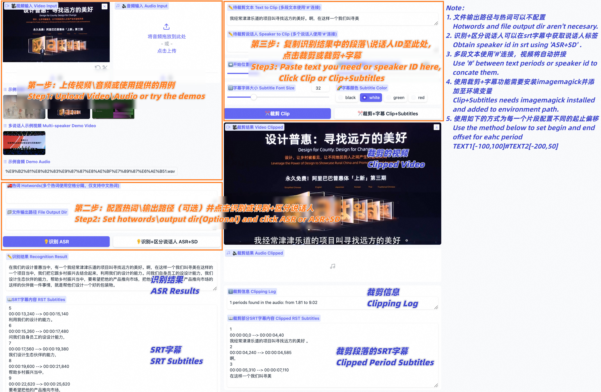
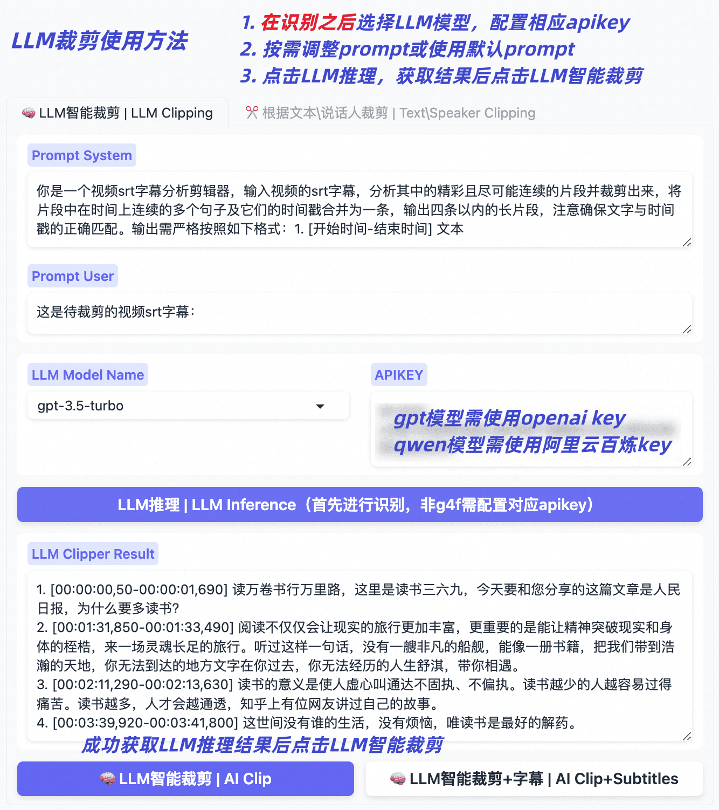

[](https://github.com/Akshay090/svg-banners)

### <p align="center">「简体中文 | [English](./README.md)」</p>

**<p align="center"> ⚡ 开源、精准、方便的视频切片工具 </p>**
**<p align="center"> 🧠 通过FunClip探索基于大语言模型的视频剪辑 </p>**

<p align="center"> </p>

<p align="center" class="trendshift">
<a href="https://trendshift.io/repositories/10126" target="_blank"></a>
</p>

<div align="center">  
<h4><a href="#近期更新"> 近期更新 </a>
｜<a href="#施工中"> 施工中 </a>
｜<a href="#安装环境"> 安装环境 </a>
｜<a href="#使用方法"> 使用方法 </a>
｜<a href="#社区交流"> 社区交流 </a>
</h4>
</div>

**FunClip**是一款完全开源、本地部署的自动化视频剪辑工具，通过调用阿里巴巴通义实验室开源的[FunASR](https://github.com/modelscope/FunASR) Paraformer系列模型进行视频的语音识别，随后用户可以自由选择识别结果中的文本片段或说话人，点击裁剪按钮即可获取对应片段的视频（快速体验 [Modelscope⭐](https://modelscope.cn/studios/iic/funasr_app_clipvideo/summary)  [HuggingFace🤗](https://huggingface.co/spaces/FunAudioLLM/FunClip)）。

## 热点&特性🎨

- 🔥FunClip集成了多种大语言模型调用方式并提供了prompt配置接口，尝试通过大语言模型进行视频裁剪~
- FunClip集成了阿里巴巴开源的工业级模型[Paraformer-Large](https://modelscope.cn/models/iic/speech_paraformer-large_asr_nat-zh-cn-16k-common-vocab8404-pytorch/summary)，是当前识别效果最优的开源中文ASR模型之一，Modelscope下载量1300w+次，并且能够一体化的准确预测时间戳。
- FunClip集成了[SeACo-Paraformer](https://modelscope.cn/models/iic/speech_seaco_paraformer_large_asr_nat-zh-cn-16k-common-vocab8404-pytorch/summary)的热词定制化功能，在ASR过程中可以指定一些实体词、人名等作为热词，提升识别效果。
- FunClip集成了[CAM++](https://modelscope.cn/models/iic/speech_campplus_sv_zh-cn_16k-common/summary)说话人识别模型，用户可以将自动识别出的说话人ID作为裁剪目标，将某一说话人的段落裁剪出来。
- 通过Gradio交互实现上述功能，安装简单使用方便，并且可以在服务端搭建服务通过浏览器使用。
- FunClip支持多段自由剪辑，并且会自动返回全视频SRT字幕、目标段落SRT字幕，使用简单方便。

欢迎体验使用，欢迎提出关于字幕生成或语音识别的需求与宝贵建议~

<a name="近期更新"></a>
## 近期更新🚀

- 2026/09/01 [FunClip v2.2.1](https://github.com/modelscope/FunClip/releases/tag/v2.2.1) 支持选择字幕颜色，并明确 MOSS 匿名说话人标签的能力边界。
- 2026/08/30 [FunClip v2.2.0](https://github.com/modelscope/FunClip/releases/tag/v2.2.0) 集成第三方 [OpenMOSS/MOSS-Transcribe-Diarize](https://github.com/OpenMOSS/MOSS-Transcribe-Diarize)，提供长音频 ASR、匿名说话人标签和分段时间戳，无需外部 VAD 或说话人模型。
- 2026/08/03 [FunClip v2.1.1](https://github.com/modelscope/FunClip/releases/tag/v2.1.1) 修复 Gradio 4 / Starlette 兼容问题，并改进容器公网分享与文本匹配行为。

[查看全部版本](https://github.com/modelscope/FunClip/releases)

<a name="施工中"></a>
## 施工中🌵

- [x] FunClip将会集成Whisper模型，以提供英文视频剪辑能力(Whisper模型的时间戳预测功能需要显存较大，我们在FunASR中添加了Paraformer英文模型的时间戳预测支持以允许FunClip支持英文识别裁剪)。
- [x] 集成大语言模型的能力，提供智能视频剪辑相关功能。大家可以基于FunClip探索使用大语言模型的视频剪辑~
- [ ] 给定文本段落，反向选取其他段落。
- [ ] 删除视频中无人说话的片段。

<a name="安装环境"></a>
## 安装🔨

### Python环境安装

FunClip的运行仅依赖于一个Python环境，若您是一个小白开发者，可以先了解下如何使用Python，pip等~
```shell
# 克隆funclip仓库
git clone https://github.com/modelscope/FunClip.git
cd FunClip
# 安装相关Python依赖
pip install -r ./requirements.txt
```

如需固定版本，可下载 [FunClip-2.2.1.tar.gz](https://github.com/modelscope/FunClip/releases/download/v2.2.1/FunClip-2.2.1.tar.gz) 或 [FunClip-2.2.1.zip](https://github.com/modelscope/FunClip/releases/download/v2.2.1/FunClip-2.2.1.zip)，并使用发布页提供的 [SHA256SUMS](https://github.com/modelscope/FunClip/releases/download/v2.2.1/SHA256SUMS) 校验文件。模型权重会在 FunClip 启动时单独下载，不包含在源码归档中。

FunClip v2.2.1 使用 Pillow 渲染可选字幕颜色，并继续在 Gradio 4 环境中要求 `starlette<1.0`。已有安装请在重启前执行 `pip install -U -r requirements.txt`。容器用户可用 `--listen` 监听全部网卡；只有同时显式传入 `--share` 才会创建 Gradio 公网分享链接。

FunClip 当前模型与字幕兼容路径需要 `funasr>=1.4.9`，其中包括 MOSS 的 vLLM 适配器、长音频生成上限、归一化的 `sentence_info` 说话人分段，以及此前的 SenseVoice 和实时修复。如果你之前已经安装过 FunClip，请先执行 `pip install -U "funasr>=1.4.9"`，再启动 Gradio 服务。[发布说明](https://github.com/modelscope/FunASR/releases/tag/v1.4.9) · [PyPI](https://pypi.org/project/funasr/1.4.9/)

### 安装 ImageMagick（可选）

内置字幕渲染器使用 Pillow 和仓库自带字体，不要求安装 ImageMagick。只有使用旧版或自定义 MoviePy `TextClip` 工作流时才需要以下配置。

- Ubuntu
```shell
apt-get -y update && apt-get -y install ffmpeg imagemagick
sed -i 's/none/read,write/g' /etc/ImageMagick-6/policy.xml
```
- MacOS
```shell
brew install imagemagick
sed -i '' 's/none/read,write/g' "$(brew --prefix imagemagick)/etc/ImageMagick-7/policy.xml" 
```
- Windows

首先下载并安装imagemagick https://imagemagick.org/script/download.php#windows

然后确定您的Python安装位置，在其中的`site-packages\moviepy\config_defaults.py`文件中修改`IMAGEMAGICK_BINARY`为imagemagick的exe路径

2. 下载你需要的字体文件，这里我们提供一个默认的黑体字体文件

```shell
wget https://isv-data.oss-cn-hangzhou.aliyuncs.com/ics/MaaS/ClipVideo/STHeitiMedium.ttc -O font/STHeitiMedium.ttc
```

<a name="使用方法"></a>
## 使用FunClip

### A.在本地启动Gradio服务

```shell
python funclip/launch.py
# '-m fun-asr-nano' 使用旗舰版 Fun-ASR-Nano（普通话、英语、日语、
# 7 类中文方言和 26 种地域口音）
# '-m sensevoice' 使用 SenseVoice 模型（多语种 ASR + 情绪识别 + 音频事件检测）
# '--model moss' 使用 OpenMOSS 长音频 ASR + 匿名说话人标签 + 时间戳
# '-l en' for English audio recognize
# '-p xxx' for setting port number
# '-s True' for establishing service for public accessing
```
#### 模型选择快速开始

| 场景 | 启动命令 |
| --- | --- |
| 默认中文视频裁剪，使用 Paraformer | `python funclip/launch.py` |
| 使用旗舰版 Fun-ASR-Nano 进行高精度转写（精确按文本裁剪请使用 Paraformer） | `python funclip/launch.py -m fun-asr-nano` |
| 使用 SenseVoice 进行多语种识别、情绪识别和音频事件检测 | `python funclip/launch.py -m sensevoice` |
| 通过本地 vLLM 转写服务使用 MOSS | `python funclip/launch.py --model moss --moss-backend vllm` |
| 使用 Paraformer 英文模型裁剪英文视频 | `python funclip/launch.py -l en` |

#### MOSS-Transcribe-Diarize 后端

[MOSS-Transcribe-Diarize](https://github.com/OpenMOSS/MOSS-Transcribe-Diarize) 是 OpenMOSS 维护的第三方模型，不属于 FunASR 或 FunClip。FunClip 固定使用 Hugging Face 模型 `OpenMOSS-Team/MOSS-Transcribe-Diarize` 的 revision `e8681d68e7042738ffca8ac8212bc8fcb1131ab8`。先按[双语生产部署指南](https://www.funasr.com/en/deploy/moss-transcribe-diarize.html)启动并验证 vLLM 服务，再运行：

```shell
# vLLM 是默认后端，默认地址为 http://127.0.0.1:8898/v1
python funclip/launch.py --model moss --moss-backend vllm

# 可选凭据只从环境变量读取，不放入命令行参数
MOSS_API_KEY=replace-me python funclip/launch.py --model moss
```

MOSS 端到端完成分段与说话人分离。`spkS01`、`spkS02` 等值只是当前录音内的匿名说话人标签，不能识别已知人物、验证已注册声纹，也不保证跨录音保持同一标签。不要再配置外部 `vad_model` 或 `spk_model`，否则切块会破坏单次录音内的标签一致性。它提供段级时间戳，适合生成 SRT、按说话人剪辑以及 LLM 按时间剪辑；任意文本的精确剪辑仍应使用带 token 时间戳的 Paraformer。FunClip 当前只开放 vLLM 路径，因为它兼容标准 Transformers 4.x 环境，并且已经通过 OpenAI 转写接口的端到端测试。

如果你只需要在 CPU 或边缘设备上离线转写语音，而不需要 FunClip 的视频剪辑界面，请优先使用 FunASR llama.cpp / GGUF 运行时：[funasr.com/llama-cpp](https://www.funasr.com/llama-cpp.html) · [Fun-ASR-Nano-GGUF](https://huggingface.co/FunAudioLLM/Fun-ASR-Nano-GGUF) · [SenseVoiceSmall-GGUF](https://huggingface.co/FunAudioLLM/SenseVoiceSmall-GGUF)。

随后在浏览器中访问```localhost:7860```即可看到如下图所示的界面，按如下步骤即可进行视频剪辑
1. 上传你的视频（或使用下方的视频用例）
2. （可选）设置热词，设置文件输出路径（保存识别结果、视频等）
3. 点击识别按钮获取识别结果，或点击识别+区分说话人在语音识别基础上识别说话人ID
4. 将识别结果中的选段复制到对应位置，或者将说话人ID输入到对应为止
5. （可选）配置剪辑参数，偏移量与字幕设置等
6. 点击“裁剪”或“裁剪+字幕”按钮



使用大语言模型裁剪请参考如下教程



#### 使用 OrcaRouter 作为 LLM 网关（可选）

除基于字幕的 LLM 外，FunClip 也可以将 LLM 智能裁剪路由到 [OrcaRouter](https://www.orcarouter.ai)——一个 OpenAI 兼容的智能路由网关。在 **LLM Model Name** 下拉框选择任意 `orcarouter/` 模型（`orcarouter/auto` 会自动为任务选择最佳模型），在 **APIKEY** 输入框粘贴 OrcaRouter API key，点击“LLM推理”——FunClip 会把字幕与 prompt 发送到 `https://api.orcarouter.ai/v1/chat/completions`，返回的分段与现有“AI Clip”按钮完全兼容。

OrcaRouter 用单一端点接入所有前沿与开源模型，无需修改 FunClip 即可切换路由目标。它还可以在同一端点上为 AI agent 提供网关级零信任控制。对经网关转发的 prompt、response 与工具调用，实际执行方式由相关作用域附加的 Guardrail 或 Firewall 策略决定；选择文档中的 `tight` posture 才会启用默认拒绝（default-deny）。该防护为可选开启：本集成只提供 base URL、API key 与模型，本身不会附加策略。请按 [security quickstart](https://docs.orcarouter.ai/security/concepts/quickstart) 应用策略；覆盖范围详见 [Guardrails](https://docs.orcarouter.ai/features/guardrails#scoping-and-the-workspace-default) 与 [Firewall](https://docs.orcarouter.ai/features/firewall#scoping-and-resolution)。

也可以不填 UI，而是设置 `ORCAROUTER_API_KEY` 环境变量（可选 `ORCAROUTER_API_BASE`，默认为 `https://api.orcarouter.ai/v1`）。Key 可在 https://www.orcarouter.ai 获取。

### B.通过命令行调用使用FunClip的相关功能
```shell
# 下载下面命令用到的示例视频
mkdir -p examples
wget "https://huggingface.co/spaces/R1ckShi/FunClip/resolve/main/examples/2022%E4%BA%91%E6%A0%96%E5%A4%A7%E4%BC%9A_%E7%89%87%E6%AE%B5.mp4" -O "examples/2022云栖大会_片段.mp4"

# 步骤一：识别
python funclip/videoclipper.py --stage 1 \
                       --file examples/2022云栖大会_片段.mp4 \
                       --output_dir ./output
# ./output中生成了识别结果与srt字幕等
# 步骤二：裁剪
python funclip/videoclipper.py --stage 2 \
                       --file examples/2022云栖大会_片段.mp4 \
                       --output_dir ./output \
                       --dest_text '我们把它跟乡村振兴去结合起来，利用我们的设计的能力' \
                       --start_ost 0 \
                       --end_ost 100 \
                       --output_file './output/res.mp4'
```

### C.通过创空间与Space体验FunClip

[FunClip@Modelscope创空间⭐](https://modelscope.cn/studios/iic/funasr_app_clipvideo/summary)

[FunClip@HuggingFace Space🤗](https://huggingface.co/spaces/FunAudioLLM/FunClip)

## 许可证

- FunClip 源码采用 [MIT License](./LICENSE)。
- 模型权重单独下载，并遵循各模型页面标注的条款。默认使用的 [Paraformer-Large](https://modelscope.cn/models/iic/speech_paraformer-large_asr_nat-zh-cn-16k-common-vocab8404-pytorch/summary)、[SeACo-Paraformer](https://modelscope.cn/models/iic/speech_seaco_paraformer_large_asr_nat-zh-cn-16k-common-vocab8404-pytorch/summary) 与 [CAM++](https://modelscope.cn/models/iic/speech_campplus_sv_zh-cn_16k-common/summary) 页面目前均标注 Apache License 2.0；重新分发前请核对适用的模型页面。


<a name="社区交流"></a>
## 社区交流🍟

FunClip开源项目由FunASR社区维护，欢迎加入社区，交流与讨论，以及合作开发等。

群二维码可能过期；如果无法扫码，请通过 [GitHub Discussions](https://github.com/modelscope/FunClip/discussions) 提问、交流想法或分享社区项目。

|                              钉钉群                                |                     微信群                      |
|:-------------------------------------------------------------------:|:-----------------------------------------------------:|
| <div align="left"> | </div> |

## 通过FunASR了解语音识别相关技术

[FunASR](https://github.com/modelscope/FunASR)是阿里巴巴通义实验室开源的端到端语音识别工具包，目前已经成为主流ASR工具包之一。其主要包括Python pipeline，SDK部署与海量开源工业ASR模型等。

📚FunASR论文: <a href="https://arxiv.org/abs/2305.11013"></a> 

📚SeACo-Paraformer论文：<a href="https://arxiv.org/abs/2308.03266"></a> 

⭐支持FunASR: <a href='https://github.com/modelscope/FunASR/stargazers'></a>
